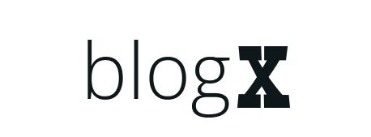

<p align="center">
  <a href="" rel="noopener">
 </a>
</p>

<h3 align="center">BlogX</h3>

---

## 📝 Table of Contents

- [About](#about)
- [Getting Started](#getting_started)
- [Deployment](#deployment)
- [Usage](#usage)
- [Built Using](#built_using)

- [Authors](#authors)

## 🧐 About <a name = "about"></a>

A full stack website that performs CRUD operations on articles. It has an authentications system. It enables users to view, create, update, and delete their blog posts. Also, it allows users to upvote and comment on other blog posts.

## 🏁 Getting Started <a name = "getting_started"></a>

### Prerequisites

You need to have node.js and npm as well as mongodb installed on your machine.

### Installing

1. Clone the repository

   ```
   git clone https://github.com/rawda-developer/BlogX
   ```

   ```
   cd BlogX
   ```

2. Install all packages
   ```
   npm install
   ```
3. Start the project
   ```
   npm run dev
   ```

## 🔧 Running the tests

```
npm test
```

## 🎈 Usage <a name="usage"></a>

Use this project as a guide for creating your next full stack web app using Next.js and mongoose

## 🚀 Deployment <a name = "deployment"></a>

This site is being deployed on vercel

## ⛏️ Built Using <a name = "built_using"></a>

- [NextJs](https://nextjs.org/) - Web Framework
- [MongoDB](https://www.mongodb.com/) - Database
- [NodeJs](https://nodejs.org/en/) - Server Environment

## ✍️ Authors <a name = "authors"></a>

- [@RawdaDeveloper](https://github.com/rawda-developer) - Idea & Initial work

See also the list of [contributors](https://github.com/kylelobo/The-Documentation-Compendium/contributors) who participated in this project.

## Designed by Figma

[Figma UI Design Mockup](https://www.figma.com/proto/q1iWAZdSeoDzjfB0xWNrFZ/BlogX?node-id=2%3A70409&scaling=scale-down&page-id=0%3A1&starting-point-node-id=2%3A70409)
